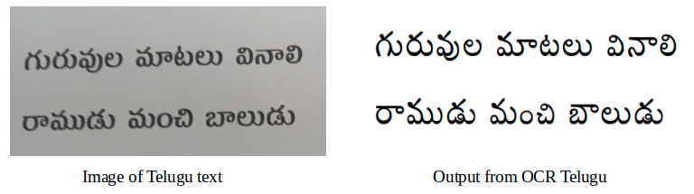

# CNN based approach to Telugu OCR

<p align="center">
  
</p>

#### Our paper is accepted at IEEE International Conference On Image Processing (ICIP) 2018, Greece.

Here the code for CNN based approach to Telugu OCR paper is avalilable.

Tested on 64 bit Linux.

## Usage
```bash
git clone https://github.com/GayamTrishal/OCR_Telugu_code.git
cd OCR_Telugu_code/models/vattu_gunintam/ours/
unzip model_v_g_weights.hdf5.zip
cd ../../..
cd OCR_Telugu_code/code
python OCR.py
```

## Training 
### Main Character
- Set file name training_testing/main_character/model_code.py, h5_file_location = 'YOURPATH/final_dataset.hdf5'
```bash
cd OCR_Telugu_code/training_testing/main_character
python model_code.py
```

### Vattu Gunintam
- Set file name in training_testing/vattu_gunintam/model_code.py, h5_file_location = 'YOURPATH/final_dataset.hdf5'
```bash
cd OCR_Telugu_code/training_testing/vattu_gunintam
python model_code.py
```

## Trained Models
Information on trained models can be found [here](https://github.com/GayamTrishal/OCR_Telugu_code/tree/master/models).

## Requirements
- Keras
- OpenCV 3.0.0 version (currently only supports this.)
- Skimage
- Numpy

## Dataset
Dataset used can be downloaded [here](https://drive.google.com/file/d/1ucYy_Emht9MRLjQPaUydSKZzN1ZQ77dd/view).

## Testing on sample image
Replace img.jpg inside OCR_Telugu_code/code folder with your image and run the code. The result will be stored in OCR_Telugu_code/code/output folder.

