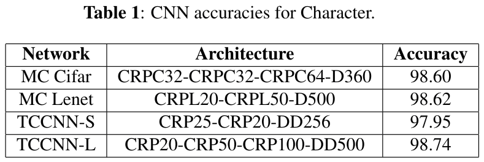
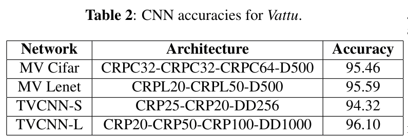

# Models for Telugu OCR 

All the final models are there in these folders. 

## Character Models

"main_character" folder contains all the trained models for base character.

## Vattu Models

"vattu_gunintam" folder contains all the trained models for vattu.

## Accuracies

The following are the accuracies for each model :-

  

  

Note: Model has been slightly modified for Cifar and Lenet to accomodate output classes but the basic Conv structure is kept intact.

